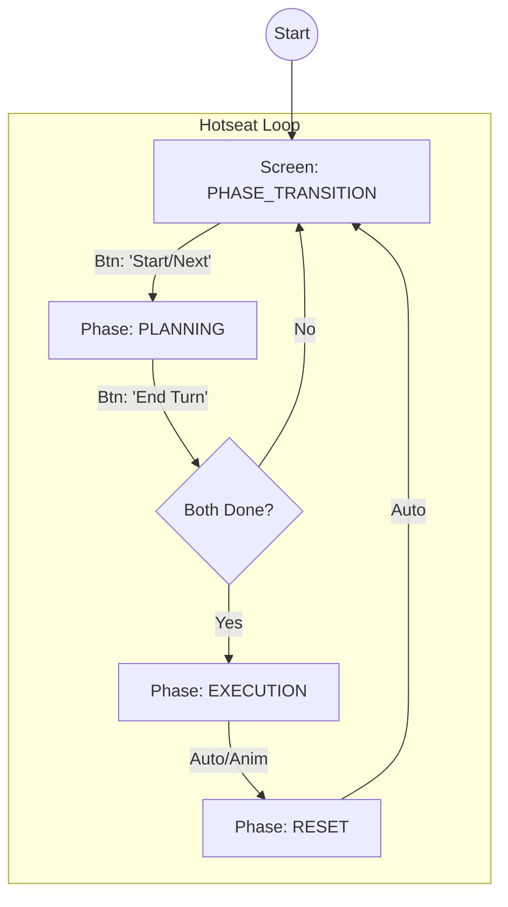

# Game State Machine Architecture

## 1. Architectural Patterns

The system MUST adhere to the following design patterns:

| Pattern | Component | Implementation Rule |
| :--- | :--- | :--- |
| **Separation of Concerns** | `GameState` vs `GameController` | State holds data *only*. Controller handles logic/transitions. |
| **Singleton (Logical)** | `GameState` | There is only ONE source of truth for the game state at any time. |
| **Immutable Snapshots** | `GamePhase` transitions | Phase changes are atomic. State is consistent before/after transition. |
| **Observer** | UI Components | UI *reacts* to state changes. UI never modifies state directly. |
| **Command Pattern** | `OrderData` | Orders are data objects reified before execution. |

## 2. Strict Vocabulary

Use these **EXACT** names for classes, variables, and enums. Do not deviate.

### Core Classes
*   `class GameState(BaseModel)`: The root state container.
*   `class GameController`: The logic handler and state mutator.

### Enums & Constants
*   `class GamePhase(str, Enum)`:
    *   `PLANNING`: Players place hidden orders.
    *   `EXECUTION`: Orders resolve simultaneously.
    *   `RESET`: Cleanup and turn rollover.
*   `class ScreenState(str, Enum)`:
    *   `PHASE_TRANSITION`: Privacy screen (blocking overlay).
    *   `GAMEPLAY`: Interactive grid view.

### Critical Variables (in GameState)
| Variable | Type | Purpose |
| :--- | :--- | :--- |
| `current_phase` | `GamePhase` | Tracks the high-level game flow. |
| `screen_state` | `ScreenState` | Controls what screen/overlay is rendered. |
| `active_player` | `int` | `0` or `1`. Whos turn is it locally (in hotseat). |
| `map` | `Dict` | Stores `HexData` keyed by `(q, r)`. |
| `units` | `Dict` | Stores `UnitData` keyed by `unit_id`. |
| `orders` | `Dict` | Stores `OrderData` keyed by `order_id`. |

## 3. Behavioral Contracts

### Controller Logic (`GameController`)

The controller must implement these logical flows. Code structure is free, but the *sequence* is mandatory.

#### `handle_click(q, r)`
*   **Contract:** Route clicks based on `current_phase`.
*   **Logic:**
    1.  IF `current_phase` != `PLANNING`: Ignore input.
    2.  IF click is valid (see cycle-tap-mechanism skill): Update `selected_hex` or `orders`.

#### `advance_phase()`
*   **Contract:** Move the FSM forward.
*   **Sequence:**
    1.  `PLANNING` -> `EXECUTION`: Trigger order resolution.
    2.  `EXECUTION` -> `RESET`: Trigger cleanup.
    3.  `RESET` -> `PLANNING`: Trigger player switch (incr `turn_number`, toggle `active_player`).

### Data Models (Schema Contracts)

*   `HexData`: Must contain `terrain`, `occupant_id`.
*   `UnitData`: Must contain `owner`, `unit_type`, `position`, `status`.
*   `OrderData`: Must contain `order_type`, `coords` (target/path), `executed` (bool).

## 4. FSM Flow & Privacy Rules

The state machine dictates **Visibility**.

### Visibility Matrix

| Context | `current_phase` | `screen_state` | Variable Visibility |
| :--- | :--- | :--- | :--- |
| **Waiting P1** | `PLANNING` | `PHASE_TRANSITION` | **None** (Overlay covers all). |
| **P1 Turn** | `PLANNING` | `GAMEPLAY` | **P1 Specific**: See P1 units/orders. P2 orders HIDDEN. |
| **Waiting P2** | `PLANNING` | `PHASE_TRANSITION` | **None** (Overlay covers all). |
| **P2 Turn** | `PLANNING` | `GAMEPLAY` | **P2 Specific**: See P2 units/orders. P1 orders HIDDEN. |
| **Cinema** | `EXECUTION` | `GAMEPLAY` | **Public**: ALL units and ALL orders visible to everyone. |

## 5. State Changes & Events

To maintain the Observer pattern, distinct events should be implicit or explicit:

1.  **Selection Change:** Updates `selected_hex`. UI MUST re-render grid highlights.
2.  **Order Placed:** Updates `orders` dict. UI MUST render the order icon/path.
3.  **Phase Change:** Updates `current_phase` + `screen_state`. UI MUST switch main view (Grid <-> Overlay).

