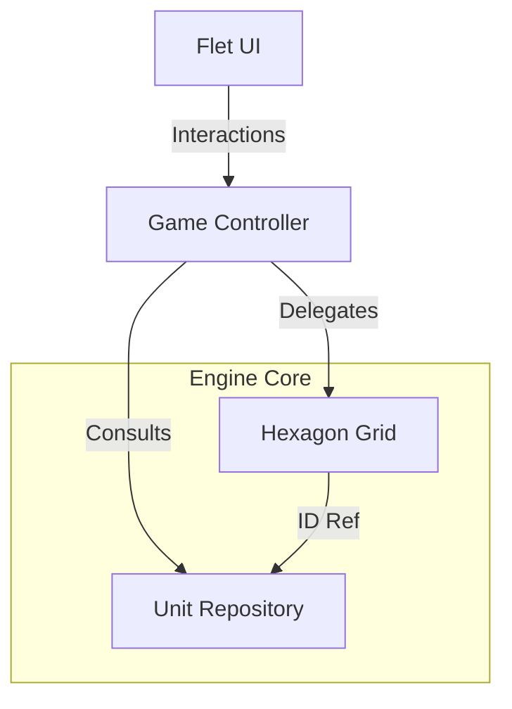

# Game State Machine Architecture

This document defines the core architecture for SyV-Flet state management. The design follows specific strict requirements: **Hexagon Open/Closed Principle** and **Unit Source of Truth**.

## 1. High-Level Architecture

The engine is divided into three distinct layers that operate agnostically of the UI (Flet).



## 2. The Hexagon (Context)

To comply with the **Open/Closed Principle**, the Hexagon is a flexible container (Context). It does not hold rigid game logic but delegates behavior to a `State` and data to an `Attributes` dictionary.

### Core Concepts
*   **Context**: The `Hexagon` class. Holds `attributes` and `occupant_id`.
*   **State Pattern**: Behavior is defined by `HexagonState` subclasses (Idle, Selected, Targeting).
*   **Attributes**: A dynamic dictionary `Dict[str, Any]` for future extensions (e.g., radiation, elevation) without modifying the class.

### Pseudocode (Python 3.12+)

```python
class Hexagon(BaseModel):
    q: int
    r: int
    attributes: Dict[str, Any] = {}
    occupant_id: Optional[str] = None
    _state: HexagonState = PrivateAttr(default_factory=IdleState)

    def interact(self, game_ctx: GameContextProtocol):
        # Delegated behavior - Open for extension via new States
        self._state.handle_interaction(self, game_ctx)
    
    def set_attr(self, key: str, val: Any):
        self.attributes[key] = val
```

## 3. The Unit Repository (Source of Truth)

Units are **not** stored inside Hexagon objects. They live in a central `UnitRepository`. The Hexagon only knows the `ID` of the unit on top of it.

### Core Concepts
*   **Single Source of Truth**: Data duplication is forbidden.
*   **Repository Pattern**: Centralized CRUD for units.
*   **Flyweight / Reference**: Grid cells reference units by ID.

### Pseudocode

```python
class Unit(BaseModel):
    uid: str
    owner_id: int
    status: UnitStatus # ACTIVE, ROUTED
    stats: Dict[str, int]

class UnitRepository:
    _units: Dict[str, Unit]

    def get(self, uid: str) -> Unit: ...
    def move(self, uid: str, to_hex: tuple) -> None: ...
```

## 4. The Global Game FSM (Controller)

The `GameController` orchestrates the macro-phases of the game (WEGO System).

### Game Phases
1.  **PLANNING**:
    *   Input: `Hexagon.interact()` -> Tap Cycling.
    *   State: Orders are hidden (`visible=False`).
    *   Transition: When both players click "Commit".
2.  **EXECUTION**:
    *   Input: Disabled / Read-only.
    *   Process: Simultaneous resolution of orders.
    *   Animation: Flet observes state changes.
3.  **RESET**:
    *   Cleanup: 5-Hex Rule, removal of dead units.
    *   Transition: Back to PLANNING.

## 5. Observability & UI Notification Bridge

The engine remains decoupled from Flet, but state changes must notify the UI layer for re-rendering.

### Core Concepts
*   **Observer Pattern**: Grid, Repository, and Controller emit events on mutations.
*   **Event Types**: Hexagon state changes, unit movement, order execution, phase transitions.
*   **Flet Subscription**: UI subscribes to specific event channels and re-renders affected regions.
*   **Batch Updates**: Group related mutations (e.g., post-phase cleanup) into single event burst to avoid per-change re-renders.

### Notification Responsibility
*   **Grid**: Notifies when hexagon attributes or states change.
*   **Repository**: Notifies when units are created, moved, destroyed, or status changes.
*   **Controller**: Notifies when game phase transitions occur.

### Event Contract
Events should include:
*   Event type identifier (for filtering)
*   Affected entities (hex coordinates, unit IDs)
*   Old and new state/value (for delta updates)
*   Timestamp (for debug / ordering)

The UI must never reach back into the engine to pull state—instead, it listens and updates its local view as events arrive.

## 6. Implementation Guidelines

### Using Protocols for Dependency Inversion
The internal engine states must not import the Controller directly (Circular Dependency). Use Protocols.

```python
class GameContextProtocol(Protocol):
    def select_hex(self, q: int, r: int): ...
    def get_unit_owner(self, uid: str) -> int: ...
```

### Extending the Hexagon
When adding a new feature (e.g., "Burning Terrain"):
1.  **Do NOT** add `is_burning` boolean to Hexagon class.
2.  **DO** add `hexagon.attributes['burning'] = True`.
3.  **DO** optionally create a `BurningState` if interaction changes.

## 7. Sequence Diagram: Selection

```mermaid
sequenceDiagram
    participant User
    participant Controller
    participant Hex(0,0)
    participant State(Idle)
    
    User->>Controller: Click(0,0)
    Controller->>Hex(0,0): interact(ctx)
    Hex(0,0)->>State(Idle): handle_interaction(self, ctx)
    State(Idle)->>Controller: select_hex(0,0)
    Controller->>Hex(0,0): set_state(Selected)
    Note right of Hex(0,0): Now in SelectedState
```
