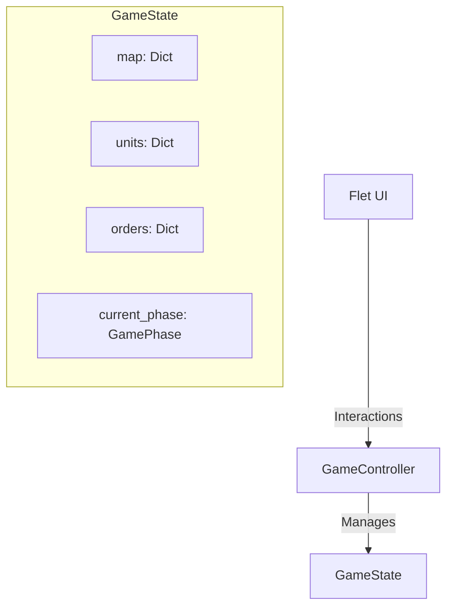

# Game State Machine Architecture

## 1. High-Level Architecture



## 2. GameState (Pydantic)

```python
from pydantic import BaseModel, Field
from typing import Dict, Tuple, Optional, List
from collections import deque
from enum import Enum

class GamePhase(str, Enum):
    PLANNING = "planning"
    EXECUTION = "execution"
    RESET = "reset"

class GameState(BaseModel):
    map: Dict[Tuple[int, int], HexData] = Field(default_factory=dict)
    units: Dict[str, UnitData] = Field(default_factory=dict)
    orders: Dict[str, OrderData] = Field(default_factory=dict)

    current_phase: GamePhase = GamePhase.PLANNING
    active_player: int = 0
    turn_number: int = 0

    selected_hex: Optional[Tuple[int, int]] = None
    order_path: List[Tuple[int, int]] = Field(default_factory=list)

    next_unit_id: int = 0
    next_order_id: int = 0
    order_history: deque = Field(default_factory=lambda: deque(maxlen=500))
```

## 3. Data Structures

### HexData

```python
class TerrainType(str, Enum):
    GRASS = "grass"
    WATER = "water"

class HexData(BaseModel):
    terrain: TerrainType = TerrainType.GRASS
    occupant_id: Optional[str] = None
    last_order_id: Optional[str] = None
    attributes: Dict[str, Any] = Field(default_factory=dict)
```

### UnitData

```python
class UnitType(str, Enum):
    INFANTRY = "infantry"
    OFFICER = "officer"
    CAPTAIN = "captain"

class UnitStatus(str, Enum):
    ACTIVE = "active"
    ROUTED = "routed"
    RETREAT = "retreat"
    ELIMINATED = "eliminated"

class UnitData(BaseModel):
    owner: int
    unit_type: UnitType
    position: Tuple[int, int]
    status: UnitStatus = UnitStatus.ACTIVE
```

### OrderData

```python
class OrderType(str, Enum):
    ATTACK = "attack"
    MOVE = "move"
    DEPLOY = "deploy"
    DEFEND = "defend"
    CANCEL = "cancel"

class OrderData(BaseModel):
    unit_id: str
    order_type: OrderType
    coords: Tuple[int, int] | Tuple[int, int, int, int]
    turn: int
    executed: bool = False
```

## 4. GameController

```python
class GameController:
    def __init__(self, state: GameState):
        self.state = state

    def handle_click(self, q: int, r: int) -> None:
        if self.state.current_phase != GamePhase.PLANNING:
            return

        if self.state.selected_hex is None:
            self._try_select_origin(q, r)
        elif (q, r) == self.state.selected_hex:
            self._cycle_origin()
        elif self._is_adjacent(self.state.selected_hex, (q, r)):
            self._handle_adjacent_tap(q, r)

    def advance_phase(self) -> None:
        match self.state.current_phase:
            case GamePhase.PLANNING:
                self.state.current_phase = GamePhase.EXECUTION
                self._resolve_orders()
            case GamePhase.EXECUTION:
                self.state.current_phase = GamePhase.RESET
                self._cleanup()
            case GamePhase.RESET:
                self.state.current_phase = GamePhase.PLANNING
                self._switch_player()
```

## 5. FSM Phases

```
┌─────────────┐       ┌─────────────┐       ┌─────────────┐
│  PLANNING   │ ───>  │ EXECUTION   │ ───>  │   RESET     │
└─────────────┘       └─────────────┘       └─────────────┘
      ↑                                            │
      └────────────────────────────────────────────┘
```

| Phase | Input | Orders | Action |
|-------|-------|--------|--------|
| PLANNING | Enabled | `executed: False` | Players place orders via tap cycling |
| EXECUTION | Disabled | `executed: True` | Resolve movements and combat |
| RESET | Disabled | FIFO cleanup | Apply 5-Hex Rule, switch player |

## 6. Selection State

Selection tracking is simple state in `GameState`:

```python
# Select origin
state.selected_hex = (q, r)

# Build order path
state.order_path = [(q1, r1), (q2, r2)]

# Clear selection
state.selected_hex = None
state.order_path.clear()
```

## 7. Observability

Events emitted on state changes:

```python
class GameEvent(BaseModel):
    event_type: str
    affected: List[Tuple[int, int] | str]
    old_value: Any = None
    new_value: Any = None
    timestamp: float
```

UI subscribes and re-renders on events.

## 8. Extending GameState

Future features use `HexData.attributes`:

```python
state.map[(q, r)].attributes["burning"] = True
state.map[(q, r)].attributes["elevation"] = 5
```
